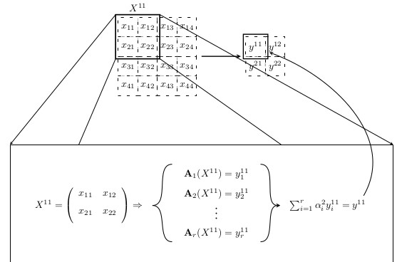

# CombPool layers
This project implements CombPool layer, a new pooling layer that enables the linear combination of different pooling functions, generating increasing functions as a result. Figure 1 illustrates the behaviour of a CombPool layer.
 
Documentation is available in English and Spanish.

-------------------------------------------------------------------

Este proyecto implementa la capa CombPool, una nueva capa de pooling que permite combinar linealmente diferentes funciones de pooling, generando funciones crecientes como ersultado. La Figura 1 ilustra el funcionamiento de una capa CombPool.

La documentación está disponible en Inglés y Castellano.



-------------------------------------------------------------------

* [Main use cases (EN)](#main-use-cases-en).
* [Casos de uso principales (ES)](#casos-de-uso-principales-es)
  * [Funcionamiento del script de pruebas](#funcionamiento-del-script-de-pruebas)
  * [Evaluación de un modelo guardado](#evaluación-de-un-modelo-guardado)
  * [Generación de hojas de cálculo con resultados](#generación-de-hojas-de-cálculo-con-resultados)
  * [Organización de archivos de log para análisis mediante Tensorboard](#organización-de-archivos-de-log-para-análisis-mediante-tensorboard)
* [Examples (EN)](#examples-en)
* [Ejemplos (ES)](#ejemplos-es)
* [Requirements (EN)](#requirements-en)

## Main use cases (EN)

Coming soon...


## Casos de uso principales (ES)

### Funcionamiento del script de pruebas

Descripción de los parámetros de entrada:

```
* model_type (obligatorio): str -> Especifica el tipo de red a emplear. Las opciones son:
	lenet: LeNet-5 (inputs 32x32)
	nin: Network in Network (con hidden supervision) (inputs 32x32)
	dense100: DenseNet de 100 capas (inputs 32x32)
	big_dense121: BigDenseNet de 121 capas (inputs 224x224)
* dataset (opcional): str -> Especifica el dataset a emplear. Las opciones son:
	CIFAR10 (por defecto)
* name (opcional): str -> Identificador del test a utilizar. Se utilizará para almacenar los modelos, resultados y logs de ejecución.
* pool_type (opcional): str -> Especifica el tipo de capa de pooling a emplear. Las opciones son:
	max (por defecto): MaxPool2d
	avg: AvgPool2d
	channelwise: ChannelwiseCombPool2d
	gated: GatedCombPool2d
* pool_aggrs (opcional): list<str> -> Si pool_type es "channelwise" o "gated", indica las funciones a combinar en el proceso de pooling. Las opciones son:
	min: Mínimo
	max: Máximo
	median: Mediana
	sum: Sumatorio
	avg: Media aritmética
	sugeno: Integral de sugeno
	dv_sugeno_general: Generalización de la integral de sugeno
* num_runs (opcional): int -> Indica el número de ejecuciones de este test a repetir. Por defecto 5.
* save_checkpoints (opcional): bool -> Si se indica este parámetro seguido de cualquier string, se tomará como verdadero. Guarda el mejor modelo entrenado durante la ejecución del entrenamiento en base al coste calculado en el conjunto de validación. WARNING: Por comprobar
* log_param_dist (opcional): bool -> Si se indica este parámetro seguido de cualquier string, se tomará como verdadero. Añade a los logs de entrenamiento información sobre las distribuciones de los parámetros del modelo.
* config_file_name (opcional): str -> Nombre del archivo de configuración con los parámetros del test que va a ejecutarse. Por defecto se utiliza "default_parameters.json".
```

Nota: Los parámetros de todos los scripts pueden consultarse mediante el comando:
```
python PATH_TO_SCRIPT.py --help
```

1. El punto de entrada del proceso de entrenamiento es el script */src/runs/run_test.py*

    Este script lleva a cabo los siguientes procesos:
	1. Lee múltiples parámetros de entrada mediante el método *argparse()* que especifican las características de la prueba a realizar. Se parsean y se guardan sus valores como variables.
    
        Nota: En la carpeta */runs* se provee un bash script de muestra sobre un posible uso del proyecto.  
	2. Se llama a la función *full_test()*, enviándole los parámetros leídos previamente. El resto de pasos se realizan en la función *full_test()*.
	3. Se leen el resto de parámetros necesarios a partir de una archivo .json situado en la carpeta */config*. Los parámetros de la prueba se almacenan en un diccionario "info_data" que se usará posteriormente.
	4. Se crean carpetas para los resultados del test en las carpetas */reports/models*, */reports/results* y */reports/runs*.
		
        Nota: 
        
		```
		/reports/models: Almacena los parámetros de los modelos ya entrenados para su posterior carga (si fuera necesario).  
		/reports/results: Almacena los resultados de métricas de los distintos modelos entrenados, medidos sobre la partición de test (en ficheros de nombre test_metrics.txt).
		/reports/runs: Almacena logs generados usando la herramienta Tensorboard para su posterior carga con dicha herramienta.
		```

	5. Se entra en el bucle principal del programa: Cada iteración del bucle entrena un modelo distinto y repite los siguientes pasos:
        1. Se genera una nueva carpeta dentro de la carpeta de test creada previamente con nombre "test0", "test1", etc.
      	2. Se genera un nuevo modelo a partir de los parámetros cargados. Se generan los objetos optimizer, scheduler y criterion necesarios para el entrenamiento.
		3. Se llama al método *train()* del script */src/model_tools/train.py* -> Ver parte 2
		4. Tras la ejecución del método *train()*, se obtiene un objeto "model" que incluirá el modelo entrenado sobre la partición de train del dataset indicado.
		5. Se llama al método *get_prediction_metrics()* del script */src/model_tools/evaluate.py* con el objeto "model" y la partición de test, y posteriormente al método *log_eval_metrics()* del script */src/data/save_results.py* para generar un fichero de nombre "test_metrics.txt" con los resultados de la evaluación.
		6. Se llama al método *save_model()* del script */src/model_tools/save_model.py* con el objeto "model" y el diccionario de valores "info_data", que facilitará la carga de datos posteriormente.
		7. 
2. Proceso de entrenamiento de *train()*
	
    Este método es el encargado de llevar a cabo el entrenamiento de un modelo dado. 
	
    Recibe como entrada los siguientes parámetros (Nota: no todos los parámetros son obligatorios):
		
        * name: Nombre del test (generado en la función full_test())
		* model: Modelo a entrenar.
		* optimizer, criterion, scheduler: Objetos que guían el proceso de aprendizaje del modelo.
		* train_loader, val_loader: Dataloaders que cargan los datos de entrenamiento y validación, respectivamente
		* using_tensorboard: Si es True, genera logs que posteriormente permitirán visualizar el entrenamiento usando la herramienta Tensorboard. NOTA: De aquí en adelante asumimos que es True
		* otros
	1. Se comienza consultando si se dispone de un dispositivo CUDA desde el que llevar a cabo la ejecución de las pruebas.
	2. Se genera un archivo de log en la carpeta */reports/runs/name* (donde "name" hace referencia al nombre de nuestro test) para ser leído usando la herramienta Tensorboard. Se genera un objeto "SummaryWriter" que será el encargado de escribir este log.
	3. Se realiza una primera escritura de los atributos a ser guardados por el modelo mediante el objeto "SummaryWriter".
	4. Se entra en el bucle de entrenamiento (se repetirá tantas veces como establezca el atributo "num_epochs"):
		1. Se inicia un nuevo bucle que recorre todos los batches de la partición de entrenamiento (se repetirá tantas veces como batches haya en train_val)
			1. El entrenamiento del modelo se lleva a cabo aquí.
			2. Cada "iters_per_log" iteraciones se loggean nuevos resultados mediante el objeto "SummaryWriter" (referentes a la partición de entrenamiento)
		2. Tras el bucle de entrenamiento se loggean nuevos resultados mediante el objeto "SummaryWriter" (referentes a la partición de validación)
	5. Se devuelve el modelo entrenado

### Evaluación de un modelo guardado

Nota: Requiere haber almacenado los modelos entrenados en una carpeta "test_name" con la estructura:

```
/reports
	/models
		/test_name
			test_0
			test_0_info.json
			test_1
			test_1_info.json
			...
```
				
Donde "test_name" es un nombre de ejemplo para un test ejecutado mediante el script */src/runs/run_test.py*.

Basta con ejecutar el script */src/runs/run_evaluation.py* indicando como parámetro el nombre del test (en el ejemplo, "test_name"). Por defecto se cargará el modelo test_0 localizado en dicha carpeta, salvo que se indique de otra manera mediante el parámetro --test_idx. Se puede fijar el parámetro --batch_size para fijar el número de ejemplos a cargar por batch (útil en entornos con límites de memoria).

1. Se cargan los parámetros de entrada mediante la función *argparse()* y se almacenan en variables.
2. Se llama a la función *run_evaluation()* enviándole los parámetros cargados previamente. El resto de pasos se realizan en la función *run_evaluation()*.
3. Se carga la información almacenada en el fichero "test_0_info.json" (test_i_info.json si se ha determinado --test_idx i). 
4. Se carga el conjunto de test del dataset indicado.
5. Se carga el modelo deseado. Para ello se genera un modelo aleatorio en base a la información de "test_0_info.json" y se reemplazan sus parámetros por los almacenados en "test_0".
6. Se evalúa el nuevo modelo sobre el conjunto de test indicado.

### Generación de hojas de cálculo con resultados

Nota: Requiere haber almacenado los resultados de la evaluación de distintos modelos en una carpeta "group_of_tests" con la estructura:

```	
/reports
	/results
		/group_of_tests
			/test_name0
				/test0
					test_metrics.txt
				/test1
					test_metrics.txt
				...
			/test_name1
				/test0
					test_metrics.txt
				/test1
					test_metrics.txt
				...
			...
```
Donde "test_name1", "test_name2", etc. son nombres de ejemplo para una serie de tests ejecutado mediante el script */src/runs/run_test.py* y "group_of_tests" es el nombre de una carpeta que los contiene a todos ellos (generada manualmente por el usuario).

Basta con ejecutar el script */src/data/summarize_excel.py* indicando como parámetro el nombre de la carpeta padre (en el ejemplo, "group_of_tests").
	
1. Se cargan los parámetros de entrada mediante la función *argparse()* y se almacenan en variables.
2. Se llama a la función *summarize_experiments()* enviándole los parámetros cargados previamente. El resto de pasos se realizan en la función *summarize_experiments()*.
3. Se obtiene el nombre de todas las carpetas presentes dentro de la carpeta */reports/results/group_of_tests*
	1. Se obtiene el nombre de todas las carpetas presentes dentro de la carpeta de cada test
		1. Se recorren todas las carpetas "test0", "test1", etc. leyendo el contenido de los ficheros "test_metrics.txt" de cada una de ellas (Nota: Solo se lee la información referente a la accuracy obtenida).
4. Se genera un DataFrame de pandas con las métricas leídas. Se calculan la media y desviación estándar de cada prueba "test_name0", "test_name1", etc.
5. Se escribe el contenido del DataFrame a un archivo .xlsx.


### Organización de archivos de log para análisis mediante Tensorboard

Nota: Requiere haber almacenado los logs del entrenamiento de distintos modelos en una carpeta "group_of_tests" con la estructura:
	
```
/reports
	/results
		/group_of_tests
			/test_name0
				/test0
					events.out.tfevents.XXX
				/test1
					events.out.tfevents.XXX
				...
			/test_name1
				/test0
					events.out.tfevents.XXX
				/test1
					events.out.tfevents.XXX
				...
			...
```

Donde "test_name1", "test_name2", etc. son nombres de ejemplo para una serie de tests ejecutado mediante el script */src/runs/run_test.py* y "group_of_tests" es el nombre de una carpeta que los contiene a todos ellos (generada manualmente por el usuario).

Basta con ejecutar el script */src/data/organize_runs.py* indicando como parámetro el nombre de la carpeta padre (en el ejemplo, "group_of_tests").

1. Se cargan los parámetros de entrada mediante la función *argparse()* y se almacenan en variables.
2. Se llama a la función *organize_experiments()* enviándole los parámetros cargados previamente. El resto de pasos se realizan en la función *organize_experiments()*.
3. Se crea una nueva carpeta */reports/results/group_of_tests/tests*
4. Se obtiene el nombre de todas las carpetas presentes dentro de la carpeta */reports/results/group_of_tests*
	1. Se obtiene el nombre de todas las carpetas presentes dentro de la carpeta de cada test
		1. Se recorren todas las carpetas "test0", "test1", etc. copiándolas, junto con sus contenidos, a nuevas carpetas con nombre "/reports/results/group_of_tests/tests/test_name0_test_0", etc.
	
Posteriormente, puede ejecutarse la herramienta tensorboard, desde la carpeta */reports/results/group_of_tests* mediante el comando "tensorboard --logdir tests".


## Examples (EN)

Examples must be run from the folder which contain each particular script:

1. Train a 'LeNet-5' model using Max pooling on CIFAR10 dataset:

```
# From src/runs/
python run_test.py lenet --dataset CIFAR10 --pool_type max --num_runs 1 --name example_lenet_max
```

2. Train a 'DenseNet' model with CombPool layers (max + avg) with 100 layers using the configuration set in */config/densenet_parameters.json* on CIFAR10 dataset:

```
# From src/runs/
python run_test.py dense100 --dataset CIFAR100 --pool_type channelwise --pool_aggrs max avg --config_file_name densenet_parameters.json
```

3. Evaluate a model trained on test "test_name":
   
```
# From src/runs/
python run_evaluation.py test_name
```

4. Organize the logfile generated by Tensorboard for the runs of tests (manually) grouped inside the folder */reports/runs/group_of_tests*:

```
# From src/data/
python organize_runs.py group_of_tests
```

5. Create a spreadsheet summary for the results of the runs of tests (manually) grouped inside the folder */reports/results/group_of_tests*:

```
# From src/data/
python summarize_excel.py group_of_tests
```

## Ejemplos (ES)

Los ejemplos deben ejecutarse desde la carpeta que contiene a cada script correspondiente:

1. Entrena un modelo 'LeNet-5' con Max pooling sobre el dataset CIFAR10:

```
# Desde src/runs/
python run_test.py lenet --dataset CIFAR10 --pool_type max --num_runs 1 --name example_lenet_max
```

2. Entrena un modelo 'DenseNet' con capas CombPool (max + media) de 100 capas, usando la configuración fijada en */config/densenet_parameters.json* sobre el dataset CIFAR10:

```
# Desde src/runs/
python run_test.py dense100 --dataset CIFAR100 --pool_type channelwise --pool_aggrs max avg --config_file_name densenet_parameters.json
```

3. Evalúa un modelo entrenado en el test "test_name":
   
```
# Desde src/runs/
python run_evaluation.py test_name
```

4. Organiza los logfiles generados por Tensorboard durante las ejecuciones de tests agrupados (manualmente) dentro de la carpeta */reports/runs/group_of_tests*:

```
# Desde src/data/
python organize_runs.py group_of_tests
```

5. Crea un resumen en una hoja de cálculo para los resultados de tests agrupados (manualmente) dentro de la carpeta */reports/results/group_of_tests*:

```
# Desde src/data/
python summarize_excel.py group_of_tests
```

## Requirements (EN)

The following command creates a conda environment with all the libraries necessary to run this project:

**CUDA installation**

Using Anaconda:

```
# From the root folder
conda env create -f environment_cuda.yml
# Alternatively you can use:
conda config --add channels conda-forge
conda config --add channels pytorch
conda create --name comb-pool-cuda --file requirements_cuda.txt
```

Using pip:

```
python3 -m venv comb-pool-cuda
pip install -r requirements_cuda_pip.txt
```

**CPU installation**

Using Anaconda:

```
# From the root folder
conda env create -f environment_cpu.yml
# Alternatively you can use:
conda config --add channels conda-forge
conda config --add channels pytorch
conda create --name comb-pool-cpu --file requirements.txt
```

Using pip:

```
python3 -m venv comb-pool-cpu
pip install -r requirements_pip.txt
```
